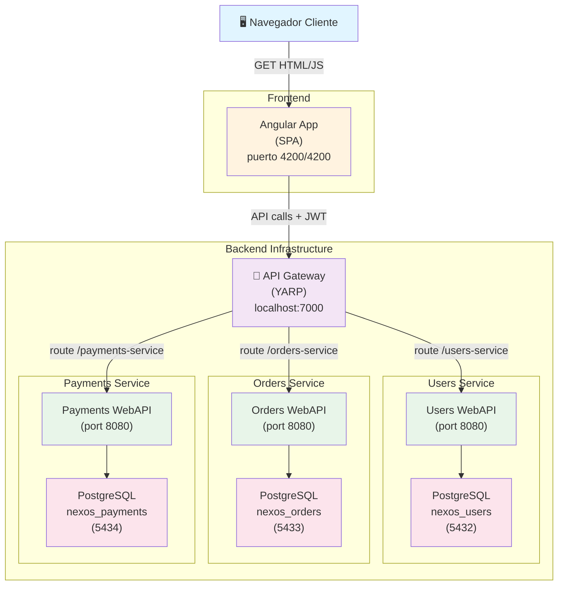
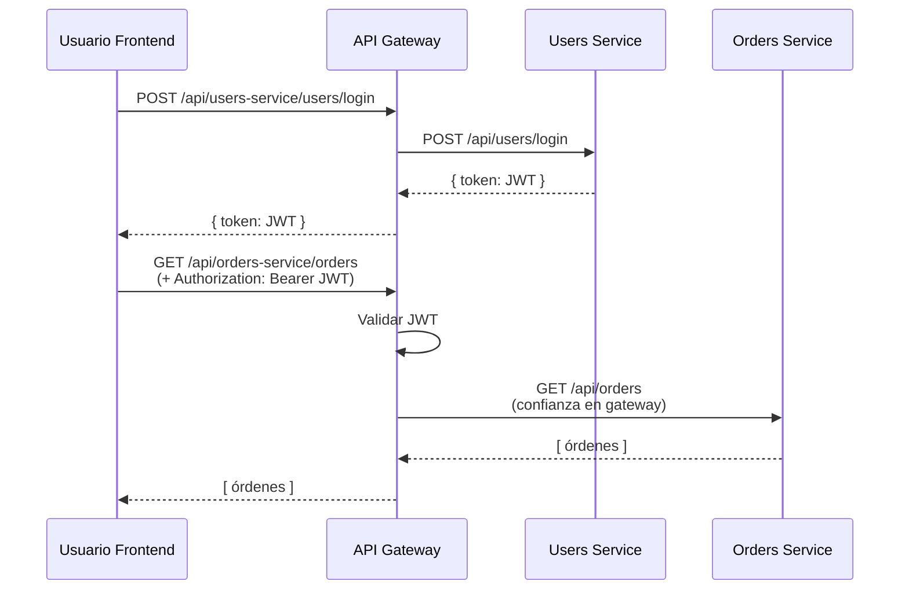

# 🏗️ Nexos - Plataforma de E-commerce con Microservicios

> Una aplicación moderna de e-commerce construida con **arquitectura de microservicios distribuidos**, separación clara entre frontend y backend, y prácticas de desarrollo escalable.

## 📋 Tabla de Contenidos

- [Descripción General](#descripción-general)
- [Diagrama de Arquitectura](#diagrama-de-arquitectura)
- [Decisiones Técnicas](#decisiones-técnicas)
- [Servicios Backend](#servicios-backend)
- [Requisitos Previos](#requisitos-previos)
- [Instalación y Configuración](#instalación-y-configuración)
- [Ejecución del Proyecto](#ejecución-del-proyecto)
- [Endpoints Disponibles](#endpoints-disponibles)
- [Estructura del Proyecto](#estructura-del-proyecto)
- [Troubleshooting](#troubleshooting)
- [Próximas Mejoras](#próximas-mejoras)

---

## 📝 Descripción General

**Nexos** es una plataforma de gestión de e-commerce que permite a los usuarios:
- Registrarse y autenticarse de forma segura
- Gestionar y ver listados de productos
- Crear pedidos
- Procesar pagos

El sistema utiliza una **arquitectura de microservicios** donde cada dominio de negocio (Usuarios, Pedidos, Pagos) tiene su propia base de datos PostgreSQL independiente. Un **API Gateway** centralizado gestiona el enrutamiento, autenticación y autorización mediante JWT tokens.

El **frontend** es una aplicación Angular moderna que proporciona una interfaz de usuario responsiva e intuitiva, comunicándose únicamente con el API Gateway.

### Características Clave
- ✅ **Arquitectura de Microservicios**: Separación clara de responsabilidades
- ✅ **Autenticación Centralizada**: JWT tokens con validación en gateway
- ✅ **Bases de Datos Independientes**: Cada servicio tiene su propia BD (Database per Service pattern)
- ✅ **Domain-Driven Design (DDD)**: En servicios backend
- ✅ **Comunicación Sincrónica**: HTTP/REST entre servicios
- ✅ **Containerización**: Docker y Docker Compose para orquestación local
- ✅ **Seguridad**: CORS, JWT Bearer, validación de autorización

---

## 🏛️ Diagrama de Arquitectura



### Flujo de Autenticación



---

## 🎯 Decisiones Técnicas

### Backend

#### 1. **Arquitectura de Microservicios**
- **Decisión**: Dividir en 3 servicios independientes (Users, Orders, Payments) + Gateway centralizado
- **Justificación**: 
  - El Gateway centraliza la autenticación y enrutamiento, evitando duplicación de lógica en cada servicio
  - No hay una necesidad de que sean microservicios, es solo por temas de requerimientos de la prueba
  - Cada servicio tiene su propia base de datos para mantener independencia total

#### 2. **.NET 10.0**
- **Decisión**: Usar ASP.NET Core como framework principal
- **Justificación**:
  - Alto rendimiento y escalabilidad
  - Excelente soporte para microservicios y contenedores

#### 3. **PostgreSQL como Base de Datos**
- **Decisión**: PostgreSQL 17 como BD para todos los servicios
- **Justificación**:
  - ACID completo: garantiza consistencia transaccional
  - Open source y gratuito, no require licencias
  - Excelente soporte en .NET vía Npgsql
  - Replicación y backup maduro

#### 4. **Database per Service Pattern**
- **Decisión**: Cada microservicio tiene su propia BD PostgreSQL independiente
- **Justificación**:
  - Máxima independencia: un servicio caído no derrumba otros
  - Escalabilidad: cada BD puede optimizarse per dominio
  - Evita el acoplamiento de datos compartidos
  - Facilita migraciones y cambios de schema sin sincronizar

#### 5. **API Gateway con YARP (Proxy Inverso)**
- **Decisión**: Centralizar routing, autenticación y autorización en gateway
- **Justificación**:
  - **Cross-cutting concerns**: Autenticación JWT en un solo lugar
  - **Single point of entry**: Cliente frontend ve una única URL (localhost:7000)
  - **Simplicidad**: YARP es ligero, no requiere aprendizaje nuevo
  - **Security**: Servicios internos no exponen puertos públicos directamente

#### 6. **JWT Bearer Token para Autenticación**
- **Decisión**: Tokens JWT firmados, 120 minutos de expiración
- **Justificación**:
  - **Stateless**: No requiere sesiones en servidor
  - **Seguro**: Tokens firmados criptográficamente, imposible falsificar
  - **Escalable**: Funciona con múltiples instancias sin sincronización

#### 7. **Patrón DDD (Domain-Driven Design)**
- **Decisión**: Estructura de cada servicio: WebApi → Application → Domain → Infrastructure
- **Justificación**:
  - **Claridad**: Cada capa tiene responsabilidad clara
  - **Testabilidad**: Lógica de negocio aislada de detalles técnicos
  - **Mantenibilidad**: Código organizado por dominio de negocio
- **Componentes**:
  - **WebApi**: Controllers REST, request/response mapping
  - **Application**: Cases de uso (Commands/Queries), servicios de aplicación
  - **Domain**: Entidades, Value Objects, reglas de negocio
  - **Infrastructure**: Acceso a BD, migrations, servicios externos

#### 8. **EntityFramework Core como ORM**
- **Decisión**: EF Core con Migrations para mapeo relacional
- **Justificación**:
  - **Integración**: Incluido en ASP.NET Core, configuración nativa
  - **Type-safe**: LINQ para queries, sin SQL raw (a menos que sea necesario)
  - **Migrations**: Control de versiones del schema de BD
  - **Performance**: Con LINQ projections, evita materializar datos innecesarios

### Frontend

#### 1. **Angular 21 + TypeScript 5.9**
- **Decisión**: Framework moderno con lenguaje fuertemente tipado
- **Justificación**:
  - **Type Safety**: Prevención de errores en compile-time, autocompletar en IDE
  - **RxJS**: Programación reactiva nativa, manejo asincrónico elegante
  - **Modular**: Lazy loading de módulos, separación clara de responsabilidades
  - **Enterprise-ready**: Usado en aplicaciones grandes, buen soporte

#### 2. **Arquitectura SPA (Single Page Application)**
- **Decisión**: Una única aplicación que maneja navegación en cliente sin recargas
- **Justificación**:
  - **UX Fluida**: Transiciones instantáneas entre páginas
  - **Offline capability**: Parcial (con service workers)
  - **Separación**: Frontend totalmente desacoplado de backend
  - **Escalabilidad**: Frontend puede servirse desde CDN


#### 3. **Guards de Autenticación**
- **Decisión**: `authGuard` en Angular protege rutas `/products` y `/orders`
- **Justificación**:
  - **UX**: Redirige a login si no hay token válido
  - **Seguridad**: Frontend rechaza acceso, complemento a backend
  - **localStorage**: Token almacenado locally para persistencia entre sesiones
- **Detalles**: Guard verifica presencia de `authToken` antes de activar ruta

#### 4. **Gestión de Estado Simple (RxJS + Servicios)**
- **Decisión**: RxJS Observables en servicios, sin Redux/NgRx en fase actual
- **Justificación**:
  - **Simplicidad**: Menos boilerplate para CRUD básico
  - **Escalable**: Si crece, fácil migrar a NgRx + Effects
  - **Suficiente**: Estado de autenticación + datos de API cubren necesidades actuales
- **Patrón**: Subject/BehaviorSubject para estado compartido, HttpClient para llamadas

#### 5. **Vitest para Testing**
- **Decisión**: Vitest (alternativa a Karma) para unit tests
- **Justificación**:
  - **Modern**: Basado en Vite, más rápido que Karma
  - **Esbuild**: Transpilación ultrarrápida
  - **Jest-compatible**: Sintaxis familiar
- **Cobertura**: Componentes, servicios, guards (incrementalmente)

---

## 🔧 Servicios Backend

| Servicio | Puerto | Base de Datos | Responsabilidad |
|----------|--------|---------------|-----------------|
| **Gateway** | 7000:8080 | — | Enrutamiento, autenticación, CORS |
| **Users** | Interno (8080) | PostgreSQL 5432 (nexos_users) | Registro, login, gestión de usuarios |
| **Orders** | Interno (8080) | PostgreSQL 5433 (nexos_orders) | Crear, actualizar, leer pedidos |
| **Payments** | Interno (8080) | PostgreSQL 5434 (nexos_payments) | Procesar y registrar pagos |

---

## 📦 Requisitos Previos

Asegúrate de tener instalado:

- **Docker Desktop** (v20.10+) — [descargar](https://www.docker.com/products/docker-desktop)
- **Docker Compose** (v2.0+, incluido en Docker Desktop)
- **Node.js** (v20+) — [descargar](https://nodejs.org/) — necesario solo para ejecutar frontend en desarrollo
- **npm** (incluido con Node.js)
- **Git** para clonar/versionado

### Verificación de Requisitos

```bash
docker --version
# Docker version 26.x.x, build xxxxx

docker-compose --version
# Docker Compose version v2.x.x

node --version
# v20.x.x

npm --version
# 10.x.x
```

Si alguno falta, instálalo antes de continuar.

---

## 🚀 Instalación y Configuración

### Paso 1: Clonar el Repositorio

```bash
git clone <REPO_URL>
cd micros-servicios
```

### Paso 2: Configurar Variables de Entorno

Cada servicio necesita su archivo `.env`. Se proporciona un **`.env.example`** en cada carpeta como plantilla.

#### Para el Gateway

```bash
cd backend/gateway
cp .env.example .env
# Edita .env si es necesario (normalmente valores por defecto funcionan)
cd ../..
```

#### Para Users Service

```bash
cd backend/users
cp .env.example .env
# Edita .env si es necesario
cd ../..
```

#### Para Orders Service

```bash
cd backend/orders
cp .env.example .env
# Edita .env si es necesario
cd ../..
```

#### Para Payments Service

```bash
cd backend/payments
cp .env.example .env
# Edita .env si es necesario
cd ../..
```

#### Para Frontend (Opcional en desarrollo, requerido en producción)

```bash
cd frontend
cp .env.example .env
# Edita .env si es necesario (por defecto apunta a localhost:7000)
cd ..
```

### Paso 3: Construir e Iniciar Contenedores del Backend

```bash
cd backend

# Construir imágenes Docker
docker-compose build

# Iniciar todos los servicios
docker-compose up -d

# Verificar que todos los servicios están corriendo
docker-compose ps
```

**Salida esperada:**
```
CONTAINER ID   IMAGE                STATUS           PORTS
xxxxxxxxxxxx   gateway-webapi       Up (healthy)     0.0.0.0:7000->8080/tcp
xxxxxxxxxxxx   users-webapi         Up (healthy)  
xxxxxxxxxxxx   orders-webapi        Up (healthy)  
xxxxxxxxxxxx   payments-webapi      Up (healthy)  
xxxxxxxxxxxx   postgres-users       Up (healthy)     0.0.0.0:5432->5432/tcp
xxxxxxxxxxxx   postgres-orders      Up (healthy)     0.0.0.0:5433->5432/tcp
xxxxxxxxxxxx   postgres-payments    Up (healthy)     0.0.0.0:5434->5432/tcp
```

### Paso 4: Instalar Dependencias del Frontend

```bash
cd frontend
npm install
```

### Paso 5: Iniciar Frontend en Desarrollo

En una **nueva terminal**:

```bash
cd frontend
npm start
# La app se abrirá automáticamente en http://localhost:4200
```

---

## 🎮 Ejecución del Proyecto

### Opción A: Ejecución Completa (Backend + Frontend)

**Terminal 1 - Backend:**
```bash
cd backend
docker-compose up
# Ctrl+C para detener
```

**Terminal 2 - Frontend:**
```bash
cd frontend
npm start
# Accede a http://localhost:4200
```

### Opción B: Ejecutar solo Backend (con Docker Compose)

```bash
cd backend
docker-compose up -d
# Los servicios corren en background

# Ver logs
docker-compose logs -f gateway

# Detener servicios
docker-compose down
```

### Opción C: Ejecutar Backend + Frontend en Desarrollo

Mismo que Opción A. El frontend corre en dev server con hot reload (recarga automática si cambias código).

---

## 🔌 Endpoints Disponibles

### Gateway Health Check

```http
GET http://localhost:7000/api/health
```

### Users Service

| Método | Endpoint | Descripción | Requiere JWT |
|--------|----------|-------------|--------------|
| `POST` | `/api/users-service/users/register` | Registrar nuevo usuario | No |
| `POST` | `/api/users-service/users/login` | Autenticarse y obtener token | No |
| `GET` | `/api/users-service/users/me` | Obtener datos del usuario actual | Sí |

**Ejemplo - Login:**
```bash
curl -X POST http://localhost:7000/api/users-service/users/login \
  -H "Content-Type: application/json" \
  -d '{
    "email": "user@example.com",
    "password": "password123"
  }'

# Respuesta:
{
  "token": "eyJhbGciOiJIUzI1NiIsInR5cCI6IkpXVCJ9...",
  "expiresIn": 120
}
```

### Orders Service

| Método | Endpoint | Descripción | Requiere JWT |
|--------|----------|-------------|--------------|
| `GET` | `/api/orders-service/orders` | Obtener todos los pedidos | Sí |
| `POST` | `/api/orders-service/orders` | Crear nuevo pedido | Sí |
| `GET` | `/api/orders-service/orders/:id` | Obtener pedido por ID | Sí |
| `PUT` | `/api/orders-service/orders/:id` | Actualizar pedido | Sí |
| `DELETE` | `/api/orders-service/orders/:id` | Eliminar pedido | Sí |

**Ejemplo - Crear Pedido (con token):**
```bash
curl -X POST http://localhost:7000/api/orders-service/orders \
  -H "Content-Type: application/json" \
  -H "Authorization: Bearer <TOKEN_JWT>" \
  -d '{
    "productId": "xxxxxxxx-xxxx-xxxx-xxxx-xxxxxxxxxxxx",
    "quantity": 2,
    "totalPrice": 299.99
  }'
```

### Payments Service

| Método | Endpoint | Descripción | Requiere JWT |
|--------|----------|-------------|--------------|
| `POST` | `/api/payments-service/payments` | Crear nuevo pago | Sí |
| `GET` | `/api/payments-service/payments/user/:userId` | Obtener pagos del usuario | Sí |

---

## 📁 Estructura del Proyecto

```
micros-servicios/
├── README.md                          ← Este archivo
├── backend/
│   ├── docker-compose.yml             ← Orquestación de servicios
│   ├── docker-compose.override.yml    ← Overrides para desarrollo
│   ├── .gitignore
│   │
│   ├── gateway/                       ← API Gateway (YARP)
│   │   ├── .env.example               ← Plantilla de variables
│   │   ├── gateway.slnx               ← Solución (legacy)
│   │   ├── src/WebApi/
│   │   │   ├── Program.cs             ← Entry point, configuración DI
│   │   │   ├── appsettings.json       ← Configuración
│   │   │   └── Dockerfile
│   │   └── ...
│   │
│   ├── users/                         ← Service: Usuarios
│   │   ├── .env.example
│   │   ├── users.slnx
│   │   ├── src/
│   │   │   ├── WebApi/                ← Controllers REST
│   │   │   ├── Application/           ← Cases de uso, handlers
│   │   │   ├── Domain/                ← Entidades, DTOs
│   │   │   ├── Infrastructure/        ← BD, EF Core migrations
│   │   │   └── SharedKernel/          ← Utilidades compartidas
│   │   └── ...
│   │
│   ├── orders/                        ← Service: Pedidos
│   │   ├── .env.example
│   │   ├── orders.slnx
│   │   └── src/ (misma estructura que users)
│   │
│   └── payments/                      ← Service: Pagos
│       ├── .env.example
│       ├── Payments.slnx
│       └── src/ (misma estructura que users)
│
└── frontend/                          ← Aplicación Angular
    ├── .env.example                   ← Configuración de entorno
    ├── package.json                   ← Dependencias npm
    ├── angular.json                   ← Configuración Angular
    ├── Dockerfile                     ← Para containerizar frontend
    ├── src/
    │   ├── main.ts                    ← Bootstrap de la app
    │   ├── index.html                 ← HTML base
    │   ├── styles.css                 ← Estilos globales
    │   └── app/
    │       ├── app.routes.ts          ← Rutas SPA
    │       ├── core/                  ← Servicios singleton (auth, http)
    │       ├── modules/               ← Módulos de negocio (auth, products, orders)
    │       ├── shared/                ← Componentes/pipes/directives compartidos
    │       └── theme/                 ← Variables de tema CSS
    ├── public/                        ← Assets estáticos (imágenes, fonts)
    └── ...
```

### Archivos Clave

| Archivo | Propósito |
|---------|-----------|
| `backend/docker-compose.yml` | Orquesta 3 servicios + 3 BDs PostgreSQL |
| `backend/gateway/src/WebApi/Program.cs` | Configuración YARP routing, JWT validation |
| `backend/*/src/Infrastructure/ServiceExtensions.cs` | DI container, EF Core setup |
| `frontend/src/app/core/auth.service.ts` | Manejo de tokens JWT, interceptores HTTP |

---

## 🐛 Troubleshooting

### Los contenedores no inician

**Error:** `docker-compose: command not found`

**Solución:** Instala Docker Desktop que incluye Compose. O actualiza Docker Compose a v2.x.

---

### Puerto en uso (error 7000 o 5432)

**Error:** `Bind for 0.0.0.0:7000 failed: port is already allocated`

**Solución:**
```bash
# Localiza qué app usa el puerto
netstat -ano | findstr :7000    # Windows

# Detén el servicio o cambia puerto en docker-compose.yml
# Línea 7: ports: - "7001:8080"   (cambiar 7000 a 7001)
```

---

### El gateway no puede comunicarse con los servicios

**Error:** `HttpRequestException: Connection refused`

**Solución:**
```bash
# Verifica que los servicios estén corriendo
docker-compose ps

# Verifica conectividad entre contenedores
docker-compose exec gateway-webapi ping users-webapi

# Si falla, comprueba networking
docker network ls
docker network inspect nexos-backend_default
```

---

### Frontend no carga o muestra error 404

**Error:** `GET http://localhost:4200/api/… 404 Not Found`

**Solución:**
```bash
# Verifica que gateway está corriendo
docker ps | grep gateway

# Verifica que frontend está apuntando a puerta correcta
# Revisa frontend/src/environments/environment.ts: apiHost: 'http://localhost:7000'

# Recarga el navegador (Ctrl+Shift+R para limpiar cache)
```

---

### Base de datos no inicializa, migrations fallan

**Error:** `Npgsql.NpgsqlException: server closed the connection unexpectedly`

**Solución:**
```bash
# Verifica que PostgreSQL está listo
docker-compose logs postgres-users | tail -20

# Espera a que healthcheck pase (puede tardar 30s)
docker-compose ps   # status debe ser "Up (healthy)"

# Si aún falla, reinicia contenedores
docker-compose restart postgres-users
docker-compose restart users-webapi

# Si problema persiste, limpia volúmenes (⚠️ borra datos)
docker-compose down -v
docker-compose up -d
```

---

### JWT token inválido o expirado

**Error:** `401 Unauthorized: Invalid token`

**Solución:**
1. Verifica que JWT__Secret es **igual** en gateway y todos los servicios (.env files)
2. Token vence en 120 minutos — vuelve a loggearte
3. Verifica header en petición: `Authorization: Bearer <token>` (no "Bearer<token>")

---

### Frontend en dev server no recarga cambios

**Error:** `npm start` levanta servidor pero cambios en código no se aplican

**Solución:**
```bash
# Detén el servidor (Ctrl+C)
# Limpia cache
rm -rf node_modules/.vite
rm -rf dist

# Reinicia
npm start
```

---

## 🔮 Próximas Mejoras

- [ ] **Event Sourcing**: Migrar a eventos asincrónicos entre servicios (RabbitMQ/Kafka)
- [ ] **SAGA Pattern**: Transacciones distribuidas multi-servicio
- [ ] **Redis Caching**: Cache distribuido de queries frecuentes
- [ ] **Integraciones de Pago**: Stripe/PayPal para pagos reales
- [ ] **Rate Limiting**: Protección contra abuso en gateway
- [ ] **OpenAPI/Swagger**: Documentación interactiva de APIs
- [ ] **Logging Centralizado**: ELK Stack (Elasticsearch, Logstash, Kibana)
- [ ] **Monitoring**: Prometheus + Grafana para métricas
- [ ] **Pruebas E2E**: Selenium/Playwright para testing de flujos completos
- [ ] **CI/CD**: GitHub Actions / Azure DevOps para deployment automático
- [ ] **Kubernetes**: Migración de Docker Compose a K8s para producción
- [ ] **GraphQL**: Alternativa a REST para ser más eficiente en consultas

---

## 📚 Recursos Útiles

- [ASP.NET Core Docs](https://learn.microsoft.com/en-us/aspnet/core/)
- [Entity Framework Core](https://learn.microsoft.com/en-us/ef/core/)
- [Angular Documentation](https://angular.io/docs)
- [Docker Best Practices](https://docs.docker.com/develop/dev-best-practices/)
- [PostgreSQL Documentation](https://www.postgresql.org/docs/)
- [JWT.io](https://jwt.io/) — Debugger y información de tokens


